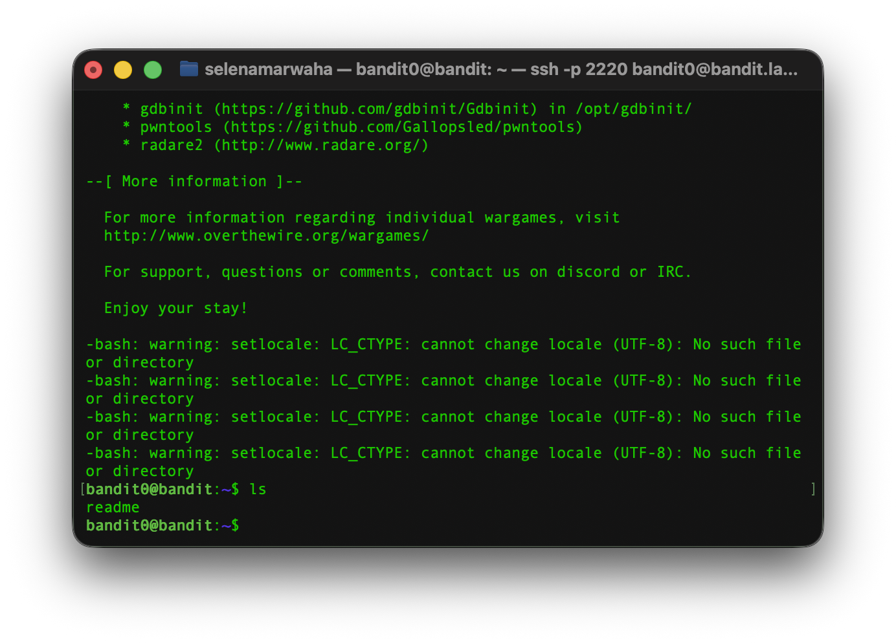
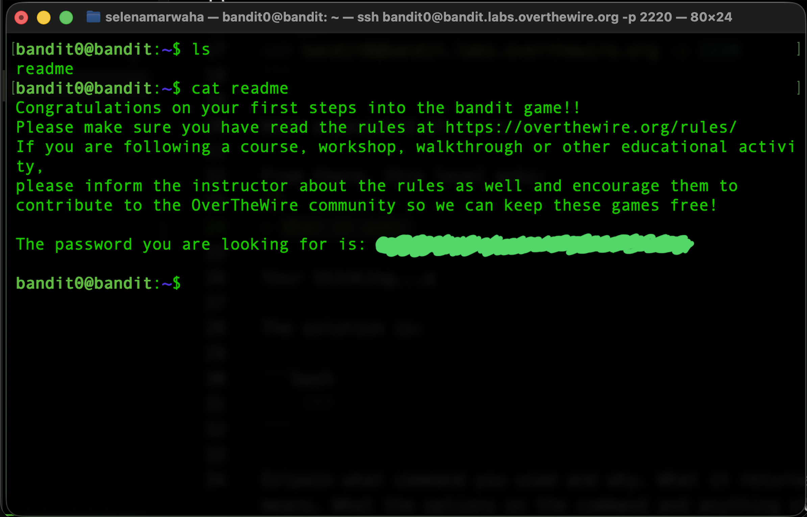

# OverTheWire Bandit 1
This is the solution to OverTheWire's Bandit Level 0→1. 

## Solution

The solution command is:
```bash
cat readme
``` 

## Instructions
This level asks...
> The password for the next level is stored in a file called readme located in the home directory. 
>
> Use this password to log into bandit1 using SSH. Whenever you find a password for a level, use SSH (on port 2220) to log into that level and continue the game.

## Background
For a full list of commands, see `dictionary.md`. 

### `cat`
`cat` takes one or more files and pours out the content in order as a single stream. 
<p align="center">
<code>
cat -n a.txt b.txt
</code>
</p>

It has the following options:

| Option | Meaning | 
| ---- | ---- | 
| -n | Numbers the lines | 
| -s | Squeezes the blank lines into one | 
| -T | Shows all tab characters as ^I |
| -b | Numbers only the non-blank lines |

## Step-by-Step 
First, we have to access the game via `ssh`. We do not change from the bandit0 shell, as we need a password to access the next level, which is stored in the bandit0 home directory. 

As such, we have the same credentials as last time: 

```bash
ssh bandit0@bandit.labs.overthewire.org -p 2220
```

With a password of `bandit0`. Now to the actual level:

First, we list the contents of the directory using `ls`. This showed: 

 

From there, we open and read the file with `cat readme`:

 

Giving us the password to SSH into level 1.

From here, we need to exit the Level 0 SSH connection and SSH into the Level 1 connection, where we paste the password.