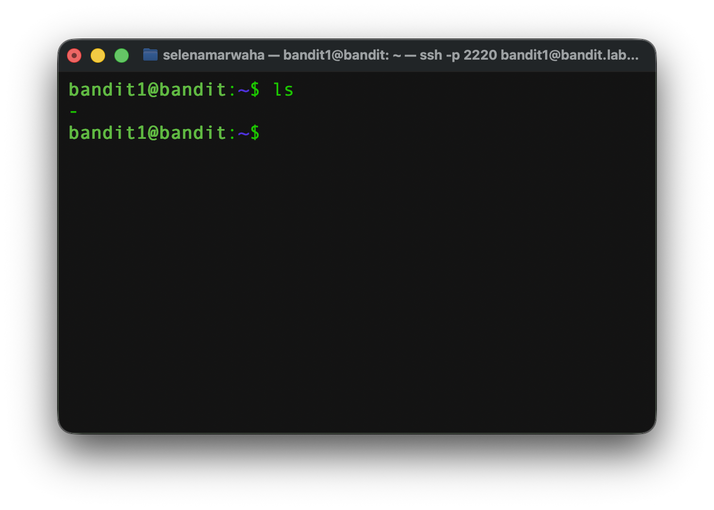
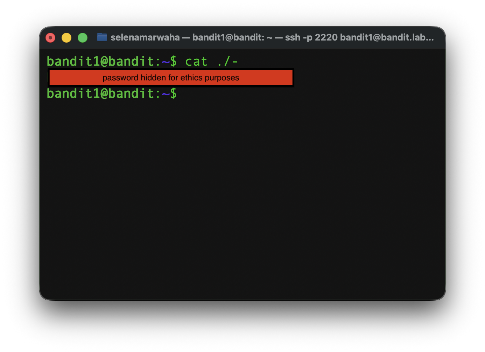

# OverTheWire Bandit 2
This is the solution to OverTheWire's Bandit Level 1→2. 

## Solution

The solution command is:
```bash
cat ./-
``` 
## Instructions
This level asks:
> The password for the next level is stored in a file called - located in the home directory

## Background
See `dictionary.md` for a full list of commands.

### `cat` 
`cat` takes one or more files and pours out the content in order as a single stream. 
<p align="center">
<code>
cat -n a.txt b.txt
</code>
</p>

It has the following options:

| Option | Meaning | 
| ---- | ---- | 
| -n | Numbers the lines | 
| -s | Squeezes the blank lines into one | 
| -T | Shows all tab characters as ^I |
| -b | Numbers only the non-blank lines |


## Explanation
First, we have to access the game via `ssh`. 

```bash
ssh bandit1@bandit.labs.overthewire.org -p 2220
```

Then, we list the contents of the directory using `ls`. This showed: 




From there, we decided to open and read the file with `cat ./-`.  

> NOTES:
> 
> `./` indicates the file is in the current directory. 
> 
> If you type `cat -`, this will read from the input of th terminal, also known as `stdin`, which is the standard input channel.



Giving us the password to SSH into level 2.

From here, we need to exit the Level 1 SSH connection and SSH into the Level 2 connection, where we paste the password.