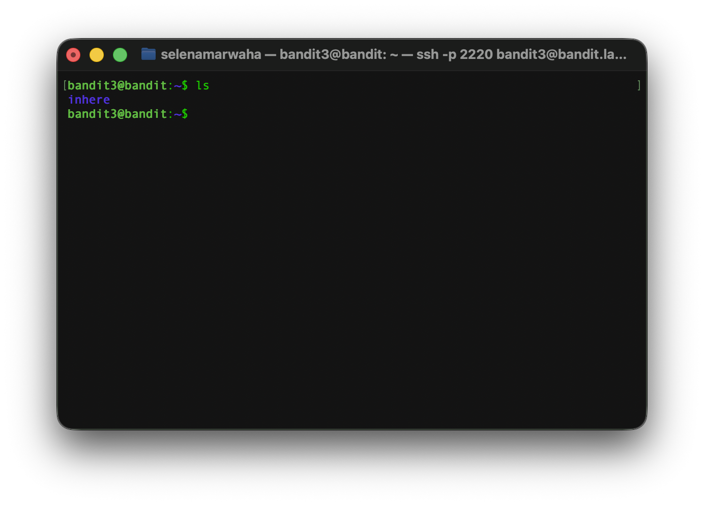
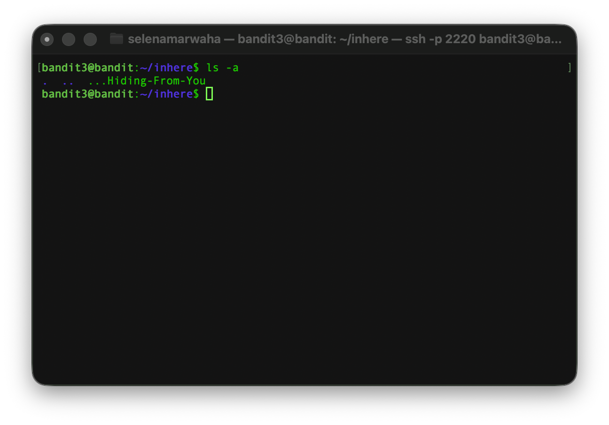
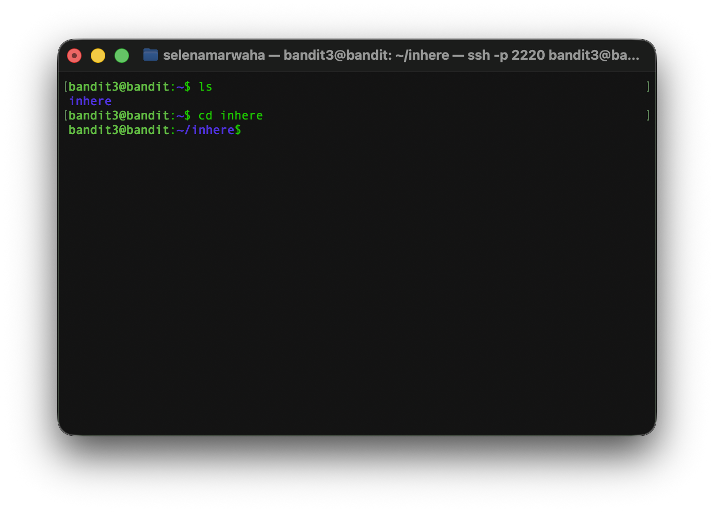
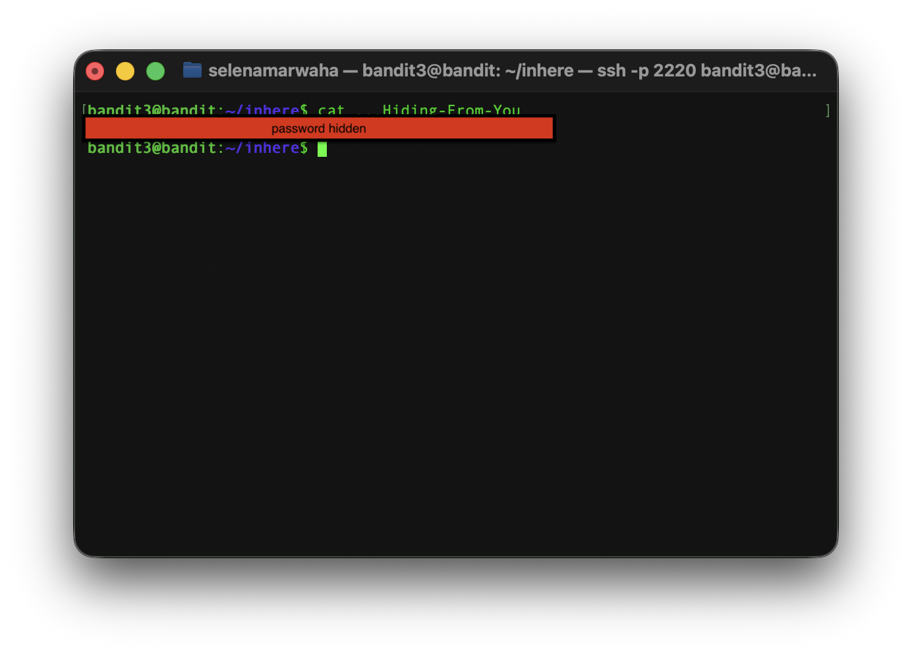

# OverTheWire Bandit 4
This is the solution to OverTheWire's Bandit Level 3→4. 

## Solution

The solution command is:
```bash
cd inhere ; ls -a ; cat ...Hiding-From-You
``` 
## Instructions
This level asks:
> The password for the next level is stored in a hidden file in the inhere directory.

## Background
See `dictionary.md` for a full list of commands.

### `cat` 
`cat` takes one or more files and pours out the content in order as a single stream. 
<p align="center">
<code>
cat -n a.txt b.txt
</code>
</p>

It has the following options:

| Option | Meaning | 
| ---- | ---- | 
| -n | Numbers the lines | 
| -s | Squeezes the blank lines into one | 
| -T | Shows all tab characters as ^I |
| -b | Numbers only the non-blank lines |

### `ls`
`ls`, which stands for list, **lists** the contents of a directory

<p align="center">
<code>
ls -la /directory
</code>
</p>

It has the following options:

| Option | Meaning | 
| ---- | ---- | 
| -a | Shows all files, including hidden files. ✪ | 
| -l | Long format; perms, owner, size, date |
| -h | With -l, prints sizes as K, M, G ✪✪ |
| -R | Recurse into every subdirectory |

> ✪ Hidden files are ones whose name starts with a dot, for example `.bashrc`

> ✪ ✪ K means kilobytes, M means megabytes, and G means gigabytes


## Explanation
First, we have to access the game via `ssh`.

```bash
ssh bandit3@bandit.labs.overthewire.org -p 2220
```

Then, let's check out the available directories and files with `ls`. This shows us a directory called `inhere`, which we can `cd` into. 



Then, we `cd` in and list the contents of the directory `inhere` using `ls -a`, as we need to view a hidden file. This showed: 



From there, we decided to open and read the file with `cat ...Hiding-From-You`. 

> NOTES:
> 
> The `-a` option on `ls` indicates that hidden files ("a" for "all") must also be shown.




Giving us the password to SSH into level 4.



From here, we need to exit the Level 3 SSH connection and SSH into the Level 4 connection, where we paste the password.