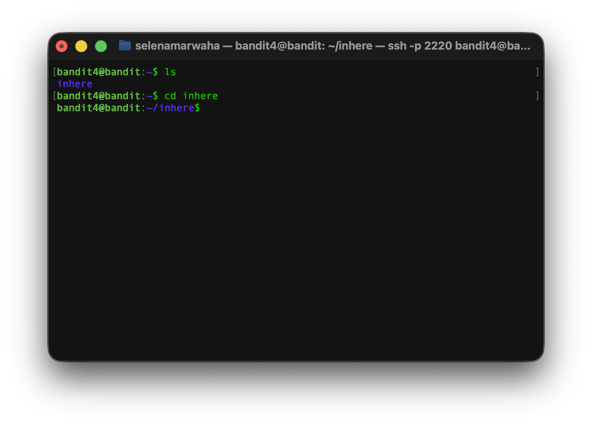
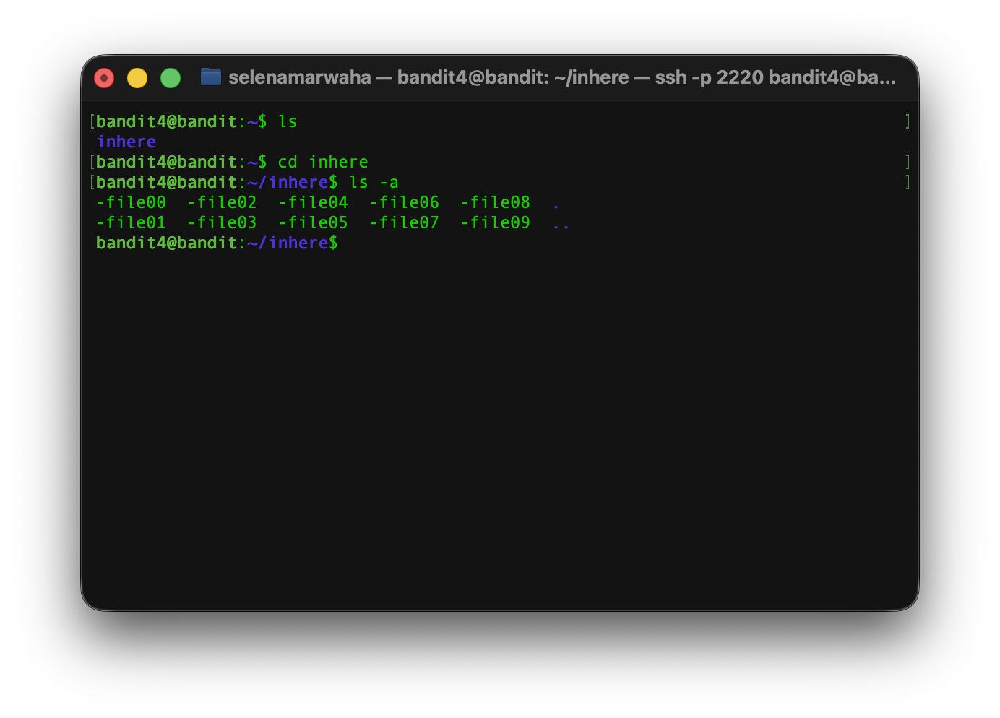
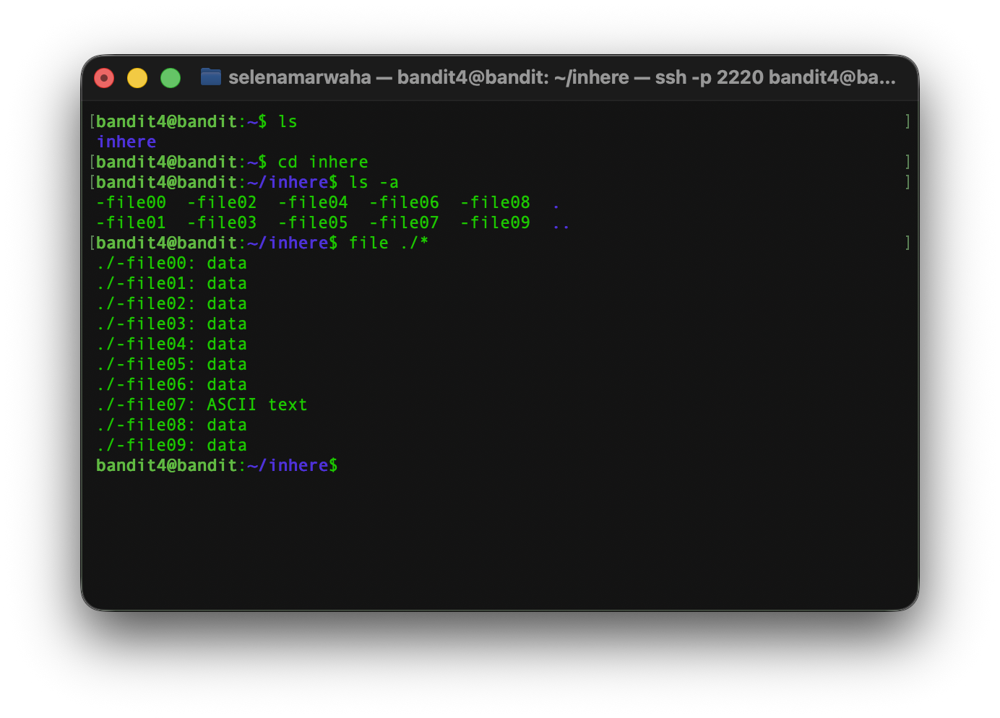
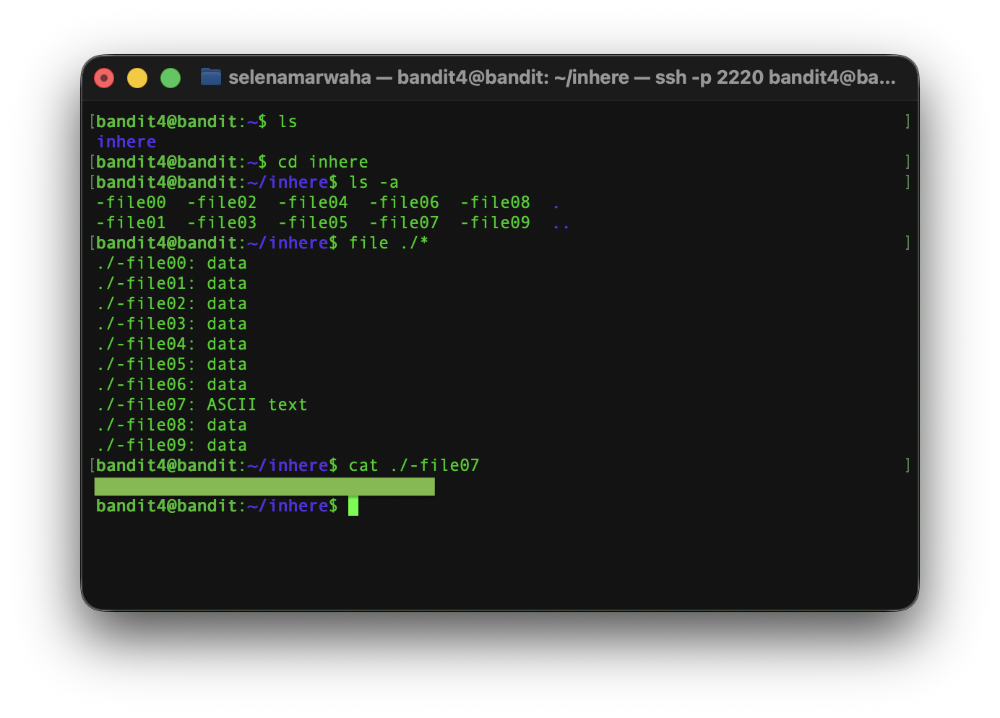

# OverTheWire Bandit 5
This is the solution to OverTheWire's Bandit Level 4→5. 

## Solution

The solution command is:

```bash
cd inhere ; ls -a ; file ./* ; cat ./-file07
``` 
## Instructions
This level asks:
> The password for the next level is stored in the only human-readable file in the inhere directory. Tip: if your terminal is messed up, try the “reset” command.


## Background
See `dictionary.md` for a full list of commands.


### `file`
`file` displays information about a file by searching for signatures in the file that indicate its type, regardless of its name or file extension. They can be useful for identifying whether a file is human-readable or not. 

<p align="center">
<code>file -b mysteryfile</code>
</p>

It has the following options:

| Option | Meaning | 
| ---- | ---- | 
| -b | Only shows the file type | 
| -i | Outputs the MIME type |
| -z | Looks inside compressed files |
| -s | Forces `file` to read things it would usually ignore. |

## Explanation
First, we have to access the game via `ssh`. 

```bash
ssh bandit4@bandit.labs.overthewire.org -p 2220
```

After a quick look, we see we need to `cd` into the `inhere` directory and view the list of files. 



Next, we need to use `ls -a` ✪ to list the contents.

> ✪ `ls -a` lists all files, including hidden files.



Looking at this, we see a lot of files. We're looking for the only human-readable one -- that is, which one is ASCII text. 

To do so, we use the `file` command, which shows us the filetype of the provided input. We use `file ./*` to grab every file in the current directory. ✪✪ 

> ✪✪  `./` indicates the current directory, and * is used to grab all entries 



We see that `./-file07` is ASCII text and, therefore, human-readable. Thus, we open the file with `cat ./-file07`. 


