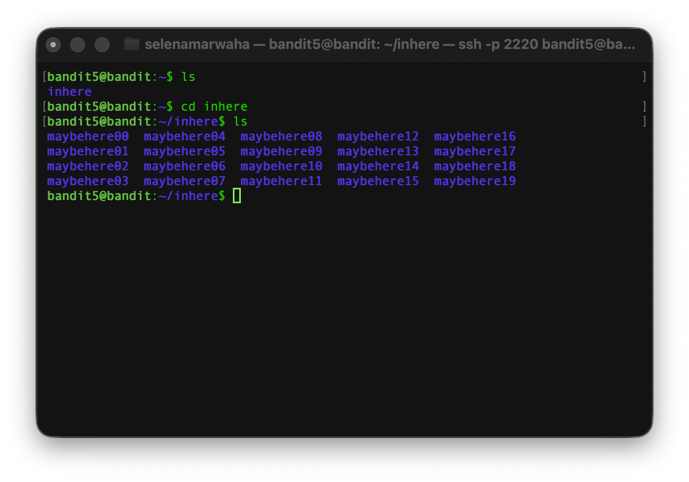
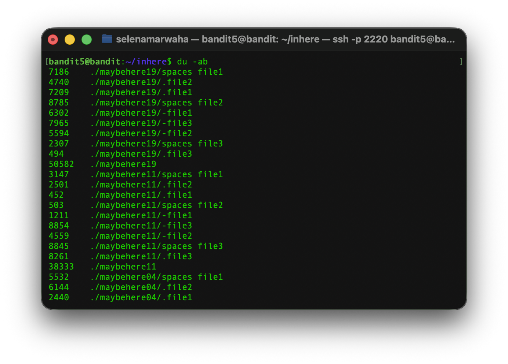
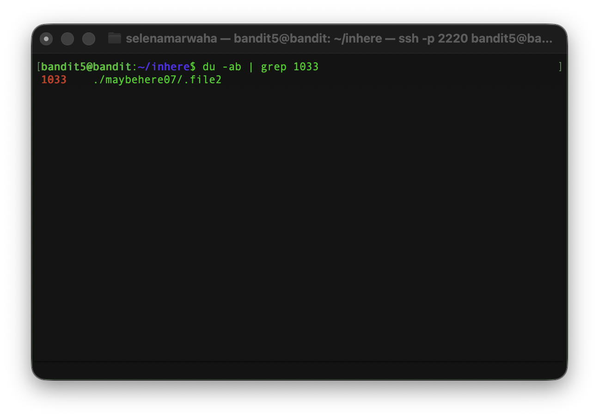
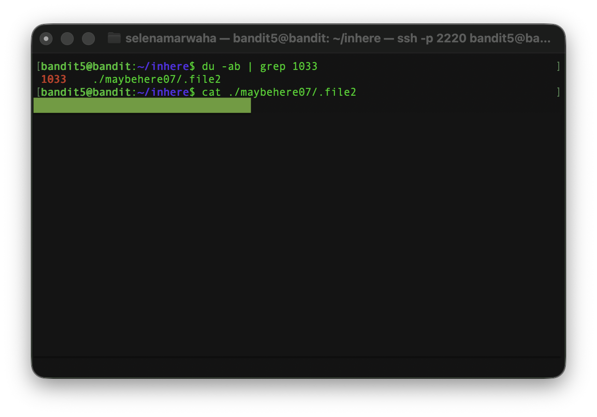

# OverTheWire Bandit 6
This is the solution to OverTheWire's Bandit Level 5→6. 

## Solution

The solution command is:
```bash
du -ab | grep 1033 ; 
``` 
## Instructions
This level asks:
> The password for the next level is stored in a file somewhere under the inhere directory and has all of the following properties:
>
>    * human-readable
>    * 1033 bytes in size
>    * not executable

## Background
See `dictionary.md` for a full list of commands.

### `pipelines`

A **pipeline** makes the *output* of the first command the *input* to the second, and so on if there are more than two comands strung together. For example, if:

<p align="center">
<code>
ls /sandbox
</code>
</p>

returns `people.txt`, and the full command is:

<p align="center">
<code>
ls /sandbox | cat
</code>
</p>

the, the end result would be to display the contents of `people.txt`.

### `du`

`du` estimates how much space files take up on your computer.

<p align="center">
<code>
du -ab file.txt
</code>
</p>

It has the following options:

| Option | Meaning | 
| ---- | ---- | 
| -b | Shows the size in bytes | 
| -a | Estimates the size for all files |
| -c | Produces a grand total |
| -h | Prints sizes in a human-readable format |

### `grep`

`grep` searches for content within files. It then prints out the matching lines.

<p align="center">
<code>
grep -i 'hello world' menu.h main.c
</code>
</p>

It has the following options:

| Option | Meaning | 
| ---- | ---- | 
| -i | Ignores the case | 
| -w | Matches whole words |
| -x | Matches whole lines |
| -v | Displays non-matching lines |

## Explanation
First, we have to access the game via `ssh`. 

```bash
ssh bandit5@bandit.labs.overthewire.org -p 2220
```

Then, we need to view the home directory. We `cd` into `inhere` and list files, which gives us: 



What we're seeing here is 20 potential directories, each with its own files. Our goal is to find the one that is 1033 bytes. 

To do so, we use `du`, which shows us the estimated file space usage. By adding the option `-a`, we have it go through all files. With `-b`, it shows the usage in bytes.



There's too many files to search visually, so we need to use `grep` to find which one(s) have 1033 bytes. As such, we search with `grep 1033`. 

We use a **pipeline** so that the output `du -ab` becomes the nput of `grep 1033`. This searches within `du -ab`. 



We've found the file! This must contain the password. We open it to find it does.



