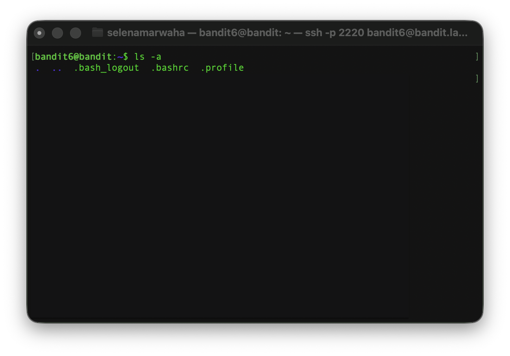
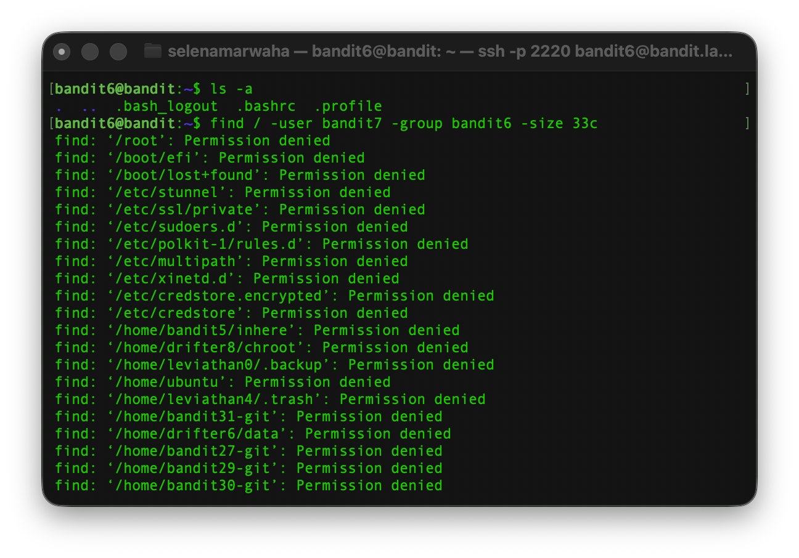
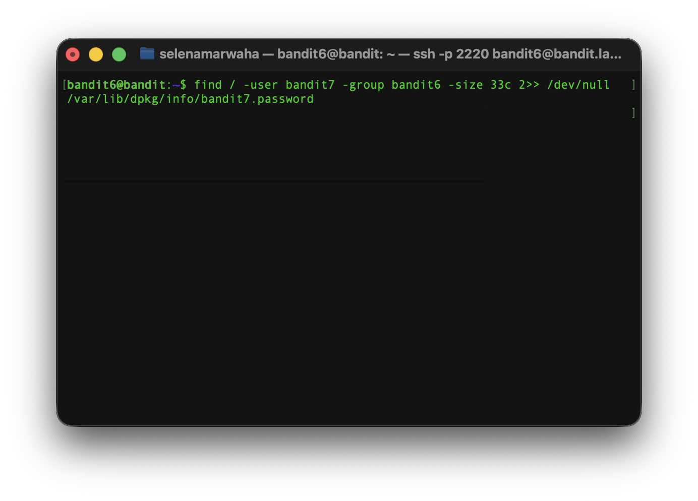
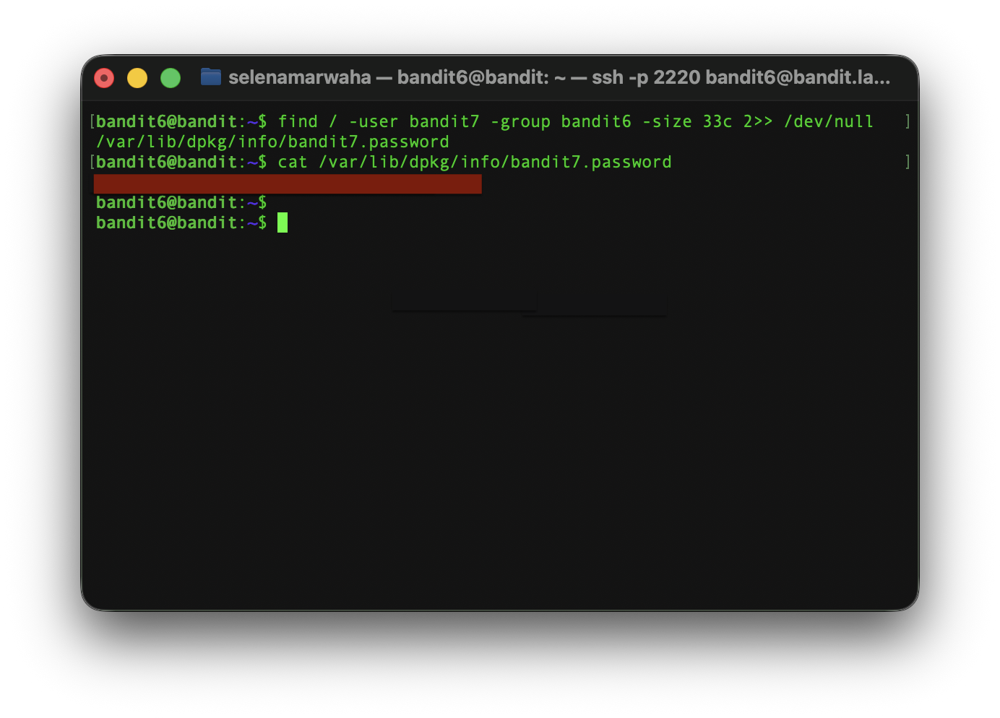

# OverTheWire Bandit 7
This is the solution to OverTheWire's Bandit Level 6→7. 

## Solution

The solution command is:
```bash
find / -user bandit7 -group bandit6 -size 33c 2>> /dev/null ; cat /var/lib/dpkg/info/bandit7.password
``` 
## Instructions
This level asks:
> The password for the next level is stored somewhere on the server and has all of the following properties:
>
> * owned by user bandit7
> * owned by group bandit6
> * 33 bytes in size

## Background
See `dictionary.md` for a full list of commands.

### `find`

`find` searches for file names and specifications such as the user and group who own the file as well as the file size.

<p align="center">
<code>
find / example.txt
</code>
</p>

It has the following options:

| Option | Meaning | 
| ---- | ---- | 
| -E | Searches using `regex` ✪ | 
| -f | Adds the path provided to the list of paths that need to be recursed into|
| -x | Prevents `find` recursing into a directory with a device number different from the original |

> ✪ Regex (a.k.a regular expressions) are basically patterns in text, with special characters that indicate special things, such as `*` which means **all**.

### `Redirection`

`Redirection` sends output, input or errors of commands to different locations. The three streams it works on are `0, stdin` (all input), `1, stdout` (all output) and `2, stderr` (all errors). 

Here's what each symbol for redirection means:

| Symbol | Meaning | 
| ---- | ---- | 
| >> | Appends output to the end of a file, new or preexisting | 
| > | Sends output to a file, overwriting its contents | 
| < | Sends the contents of a file to the input of a command | 
| 2>> | Appends errors to the end of a file, new or preexisting. | 
| 2> | Sends errors to a file, overwriting its contents | 
| &> | Sends errors and output to a file, overwriting its contents | 
| &>> | Appends errors and output to the end of a file, new or preexisting. | 

To use these, simply put them at the ends of commands:

<p align="center">
<code>
cat passwords.txt >> confidental.txt
</code>
</p>

This would redirect the output of the first command to `confidential.txt`, perhaps creating the new file or appending to the end of a preexisting one.

## Explanation
First, we have to access the game via `ssh`. 

```bash
ssh bandit6@bandit.labs.overthewire.org -p 2220
```

Then, we need to list the contents of the server using `ls -a`



After seeing this, that there are no files that we can check but many possible directories, we know we need to search from the root. 

To do so, we will use `find /`. The slash searches from the root.

According to the level, the file's user is `bandit7`, the group is `bandit6`, and the size is `33c` or 33 bytes.



We see in the output that almost everything has denied us permission to inspect the file. These are all errors, which we need to get rid of.

We do so by `redirecting` the unnecessary output to `/dev/null`, which is basically sending it to nowhere.



After sending errors to the void, we have one file which we need to view.

It is called `/var/lib/dpkg/info/bandit7.password`, and opening it reveals the password.


