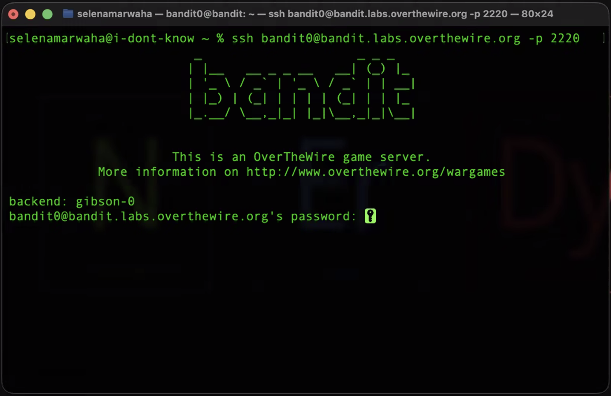
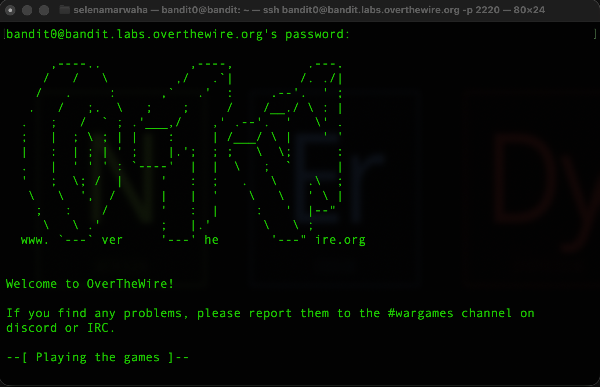

# OverTheWire Bandit0 
This is the solution to OverTheWire's Bandit Level 0. 

### Solution
The username and password are as follows:
> username: bandit0 \
> password: bandit0

The solution command is:

```bash
ssh bandit0@bandit.labs.overthewire.org -p 2220
``` 

### Explanation
This level asks...

>  The goal of this level is for you to log into the game using SSH. The host to which you need to connect is bandit.labs.overthewire.org, on port 2220. The username is bandit0 and the password is bandit0. 

So, they want us to SSH into the bandit terminal. 

To do so, we use the `ssh` or **secure shell** command. This command opens an encrypted shell on another device on the network.

The format of the command is as follows: 

```bash
ssh username@hostname -p port
``` 

`bandit0` provides a username of `bandit0` and a password of `bandit0`.

We enter this into our `ssh` pattern above to get:

```bash
ssh bandit0@bandit.labs.overthewire.org -p 2220
``` 

And when we do so, we see the following message:



This prompts us to enter our password, `bandit0`, and finally, we're in!


