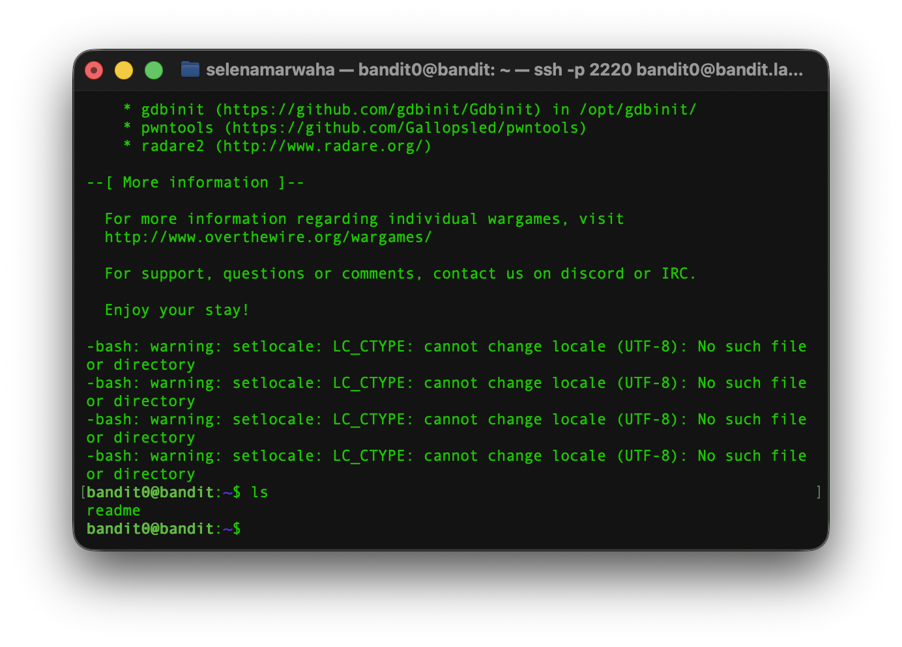
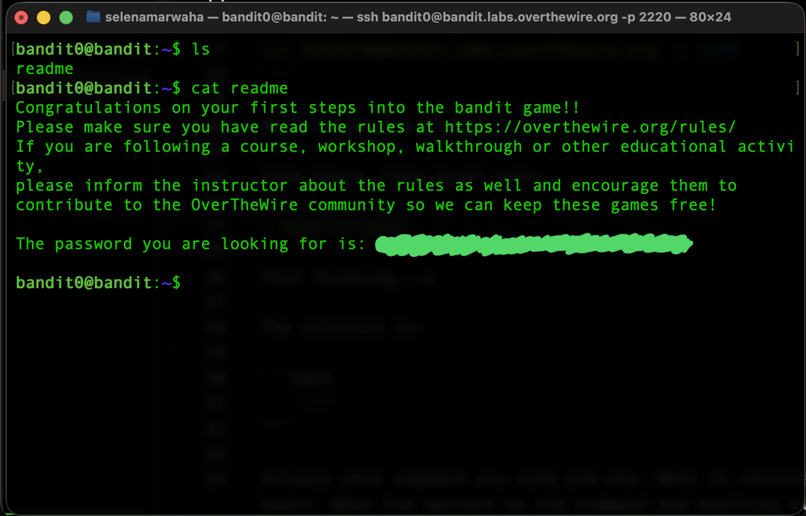

# OverTheWire Bandit 1
This is the solution to OverTheWire's Bandit Level 1. 

### Solution

The solution command is:
```bash
cat readme
``` 

### Explanation
First, we have to access the game via `ssh`. We do not change from the bandit0 shell, as we need a password to access the next level, which is stored in the bandit0 home directory. 

As such, we have the same credentials as last time: 

```bash
ssh bandit0@bandit.labs.overthewire.org -p 2220
```

With a password of `bandit0`. 

From there, this level asks: 

> The password for the next level is stored in a file called readme located in the home directory. Use this password to log into bandit1 using SSH. Whenever you find a password for a level, use SSH (on port 2220) to log into that level and continue the game.

First, we list the contents of the directory using `ls`. This showed: 

 

From there, we decided to open and read the file with `cat readme` This command works as such:

```bash
    cat readme
    "The password you are looking for is: password hidden for ethics purposes "
``` 

 

Giving us the password to SSH into level 1.


From here, we need to exit the Level 0 SSH connection and SSH into the Level 1 connection, where we paste the password.