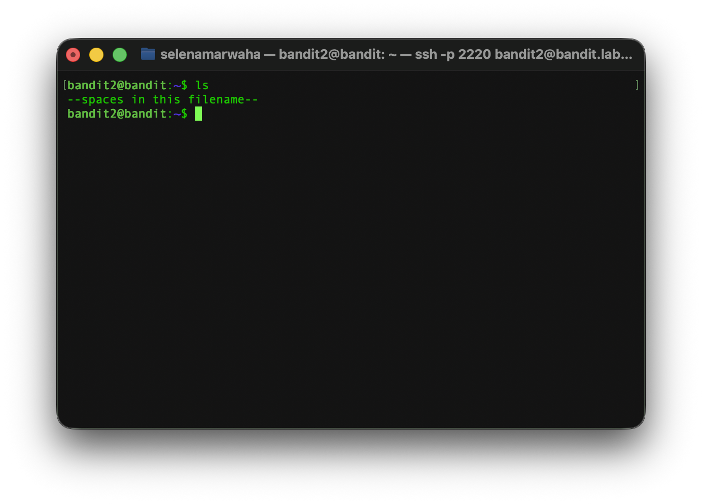
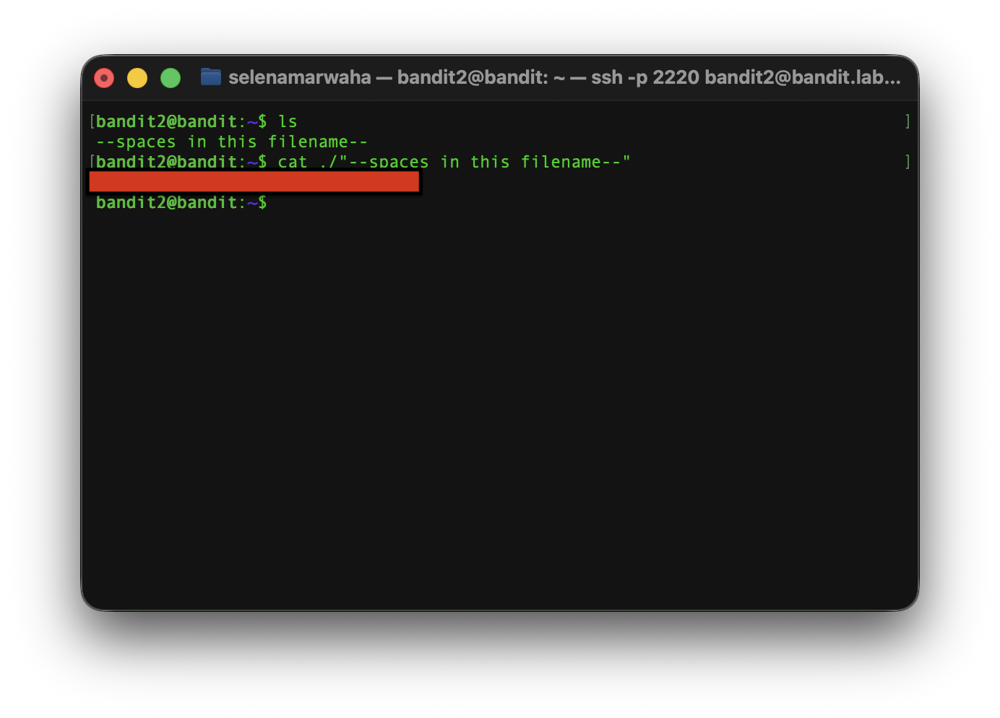

# OverTheWire Bandit 3
This is the solution to OverTheWire's Bandit Level 2→3. 

## Solution

The solution command is:
```bash
cat ./"--spaces in this filename--"
``` 
## Instructions
This level asks:
> The password for the next level is stored in a file called --spaces in this filename-- located in the home directory

## Necessary commands
See `dictionary.md` for a full list of commands.

### `cat` 
`cat` takes one or more files and pours out the content in order as a single stream. 
<p align="center">
<code>
cat -n a.txt b.txt
</code>
</p>

It has the following options:

| Option | Meaning | 
| ---- | ---- | 
| -n | Numbers the lines | 
| -s | Squeezes the blank lines into one | 
| -T | Shows all tab characters as ^I |
| -b | Numbers only the non-blank lines |


## Explanation
First, we have to access the game via `ssh`. We do not change from the bandit2 shell, as we need a password to access the next level, which is stored in the bandit2 home directory. 

As such, we have the same credentials as last time: 

```bash
ssh bandit2@bandit.labs.overthewire.org -p 2220
```

First, we list the contents of the home directory using `ls`. This showed: 



From there, we decided to `cd` into the proper directory and open and read the file using `cat ./"--spaces in this filename--"`. 



> NOTES:
> 
> `./` indicates the file is in the current directory. 
> 
> The quotes are necessary so the shell does not interpret the words as separate commands. 

Giving us the password to SSH into Level 3.

From here, we need to exit the Level 2 SSH connection and SSH into the Level 3 connection, where we paste the password.
