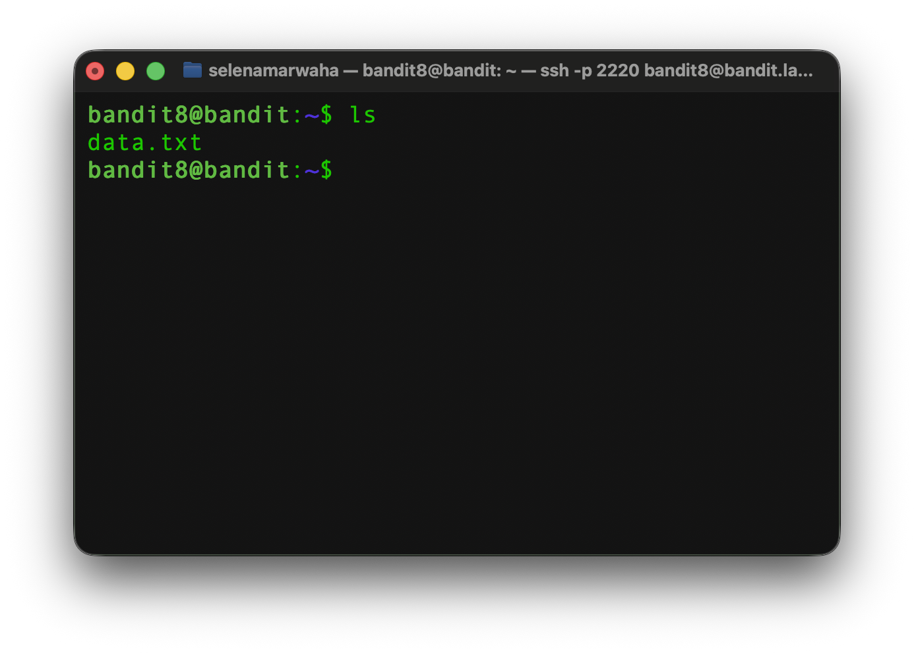
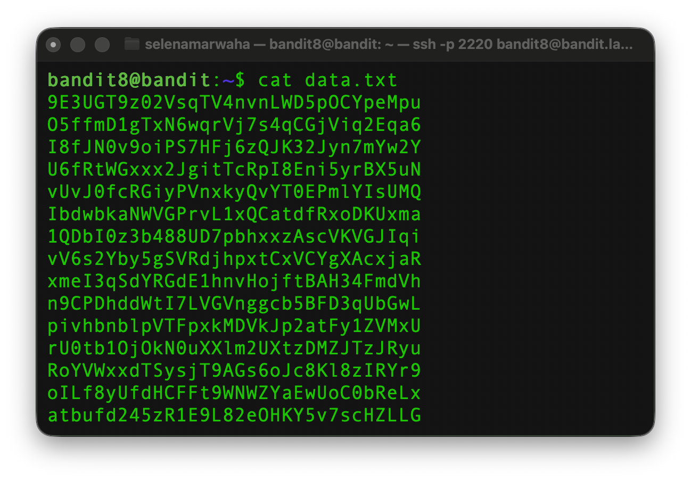
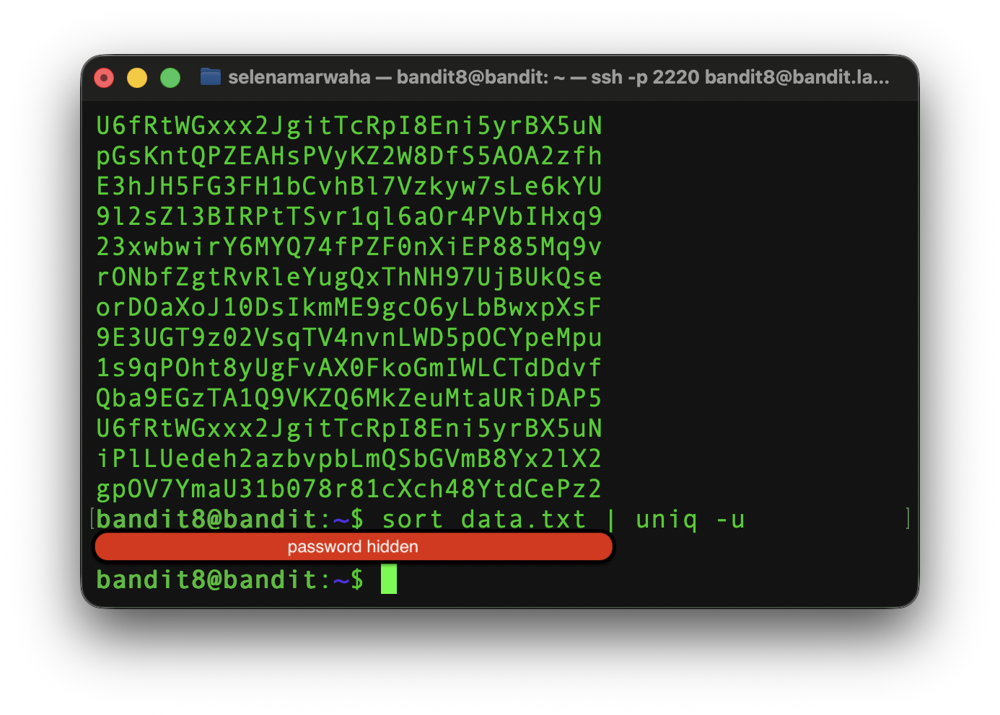

# OverTheWire Bandit 9 
This is the solution to OverTheWire's Bandit Level 9. 

## Solution
The username and password are as follows:
> username: bandit8 \
> password: hidden for ethics purposes

The solution command is:

```bash
sort data.txt | uniq -u
``` 

## Instructions
The password for the next level is stored in the file data.txt and is the only line of text that occurs only once

>  The goal of this level is for you to find the password which is stored in data.txt
> 
> The host to which you need to connect is bandit.labs.overthewire.org, on port 2220. 
>
> The username is bandit8
## Necessary Commands
### `sort`
The `sort` command **sorts** the contents of the file in alphabetical order. 

The format is as follows: 

<p align="center">
<code>
sort example.txt
</code>
</p>

### `uniq`
The `uniq` command smashes all duplicate adjacent lines into one. For example, 

```
hello
hello 
hello 
hi 
```

gets collapsed into
```
hello
hi
```
The format is as follows
<p align="center">
<code>
uniq -u example.txt
</code>
</p>

> **Note:** for full list of options such as `-u` see `dictionary.md`

### `Pipelines`

In the previous subsection, a `|` character was used to separate the two commands. This is known as a **pipeline**. It makes the *output* of the first command the *input* to the second, and so on if there are more than two comands strung together. 

**For example,**

<p align="center">
<code>
ls /sandbox
</code>
</p>

returns `people.txt`, and the full command is 

<p align="center">
<code>
ls /sandbox | cat
</code>
</p>

the end result would be the contents of `people.txt`.

> **Note:** for a full list of commands, go to `dictionary.md`


## Step-by-Step 
First, we want to list the contents of the directory. 

<p align="center">
<code>
ls
</code>
</p>

which gives us:

<p align="center">

</p>

Then, we want to list the contents of `data.txt`
<p align="center">
<code>
cat data.txt
</code>
</p>
Inside data.txt, we see lots of duplicate lines.
<p align="center">

</p>
We can sort it and display the only unique line by running

<p align="center">
<code>
sort data.txt | uniq -u
</code>
</p>

The `-u` is an option of `uniq` that makes it print the only unique line.

The output is this:

<p align="center">

</p>

> **Note:** as per OverTheWire's policy, the password is hidden for ethics purposes.